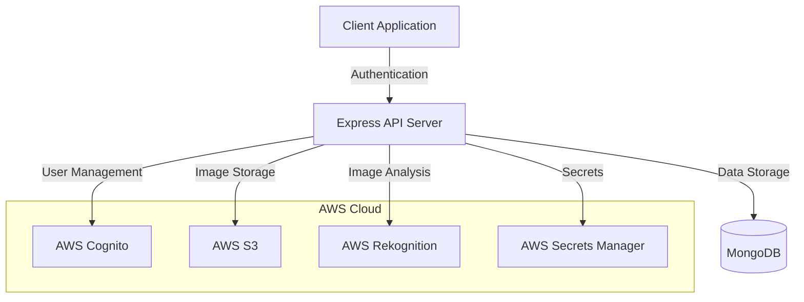

# Serverless Media Processing Documentation

## Table of Contents
1. [System Architecture](#system-architecture)
2. [Project Structure](#project-structure)
3. [API Documentation](#api-documentation)
4. [Authentication Flow](#authentication-flow)
5. [Database Schema](#database-schema)
6. [AWS Integration](#aws-integration)
7. [Frontend Documentation](#frontend-documentation)
8. [Security Features](#security-features)

## System Architecture

The application follows a serverless architecture pattern utilizing various AWS services:



## Project Structure

```
serverless_processing/
├── API_DOCUMENTATION.md
├── app.js
├── index.js             # Main application entry point
├── package.json         # Project dependencies
├── README.md
├── sample.png
│
├── controllors/         # Business logic handlers
│   ├── auth.controllor.js       # Authentication logic
│   ├── image.controllor.js      # Image processing
│   ├── media.controllor.js      # Media handling
│   ├── processedImage.controllor.js  # Processed image data
│   └── user.controllor.js       # User management
│
├── frontend/           # React frontend application
│   ├── package.json
│   ├── public/
│   └── src/
│       ├── App.js
│       ├── components/
│       ├── context/
│       └── api/
│
├── middleware/         # Express middleware
│   └── auth.middleware.js   # JWT verification
│
├── models/            # MongoDB schemas
│   ├── processedImage.model.js
│   └── user.model.js
│
├── routes/            # API routes
│   ├── auth.routes.js
│   ├── image.routes.js
│   ├── media.routes.js
│   └── user.routes.js
│
├── utils/             # Utility functions
│   ├── ApiError.js
│   ├── ApiResponse.js
│   ├── asyncHandler.js
│   ├── aws-secrets.js
│   ├── generateUserId.js
│   ├── logentries.js
│   ├── mongodb.js
│   └── urlGenerator.js
```

## API Documentation

### Authentication Endpoints

#### 1. User Signup
- **Endpoint**: `POST /api/auth/signup`
- **Authentication**: None
- **Request Body**:
```json
{
    "username": "user@example.com",
    "password": "StrongPassword123!",
    "email": "user@example.com"
}
```
- **Success Response** (200):
```json
{
    "statusCode": 200,
    "message": "Signup successful",
    "data": {
        "UserConfirmed": false,
        "UserSub": "xxxx-xxxx-xxxx",
        "CodeDeliveryDetails": {
            "Destination": "u***@example.com",
            "DeliveryMedium": "EMAIL",
            "AttributeName": "email"
        }
    }
}
```

#### 2. Confirm User
- **Endpoint**: `POST /api/auth/confirm-user`
- **Authentication**: None
- **Request Body**:
```json
{
    "username": "user@example.com",
    "code": "123456"
}
```
- **Success Response** (200):
```json
{
    "statusCode": 200,
    "message": "User confirmed",
    "data": {
        "username": "user@example.com",
        "status": "CONFIRMED"
    }
}
```

#### 3. User Signin
- **Endpoint**: `POST /api/auth/signin`
- **Authentication**: None
- **Request Body**:
```json
{
    "username": "user@example.com",
    "password": "StrongPassword123!"
}
```
- **Success Response** (200):
```json
{
    "statusCode": 200,
    "message": "Signin successful",
    "data": {
        "token": "jwt.token.here",
        "user": {
            "id": "user_id",
            "username": "user@example.com",
            "email": "user@example.com"
        },
        "cognitoTokens": {
            "accessToken": "cognito.access.token",
            "refreshToken": "cognito.refresh.token",
            "expiresIn": 3600
        }
    }
}
```

### Media Processing Endpoints

#### 1. Generate Signed URL
- **Endpoint**: `GET /api/media/generate-signed-url`
- **Authentication**: Required (JWT)
- **Success Response** (200):
```json
{
    "statusCode": 200,
    "message": "signed url generated",
    "data": {
        "signed url": "https://s3-bucket-url...",
        "filename": "unique_filename.png"
    }
}
```

#### 2. Process Image
- **Endpoint**: `POST /api/image/process-image`
- **Authentication**: Required (JWT)
- **Request Body**: Form-data with image file or JSON with image URL
- **Success Response** (200):
```json
{
    "statusCode": 200,
    "message": "Image processed successfully",
    "data": {
        "processedImageUrl": "https://processed-image-url...",
        "size": 1024,
        "format": "png"
    }
}
```

#### 3. AI Recognition
- **Endpoint**: `POST /api/image/ai-recognition`
- **Authentication**: Required (JWT)
- **Request Body**: Form-data with image file or JSON with image URL
- **Success Response** (200):
```json
{
    "statusCode": 200,
    "message": "AI recognition successful",
    "data": {
        "labels": [
            {
                "Name": "Object",
                "Confidence": 99.5
            }
        ]
    }
}
```

### Processed Image Data Endpoints

#### 1. Get Processed Image Data
- **Endpoint**: `POST /api/processed-images/get`
- **Authentication**: Required (JWT)
- **Request Body**:
```json
{
    "email": "user@example.com",
    "fileName": "image.png"
}
```
- **Success Response** (200):
```json
{
    "statusCode": 200,
    "message": "Processed images retrieved successfully",
    "data": {
        "count": 1,
        "images": [
            {
                "_id": "image_id",
                "email": "user@example.com",
                "fileName": "image.png",
                "processedFile": {},
                "rawAiResponse": {},
                "createdAt": "2025-07-22T..."
            }
        ]
    }
}
```

## AWS Integration Details

### 1. AWS Cognito
- Used for user authentication and management
- Configured with:
  - User pool for managing user accounts
  - Client application for API access
  - Custom authentication flow with email verification

### 2. AWS S3
- Used for storing uploaded and processed images
- Features:
  - Signed URLs for secure direct uploads
  - Organized folder structure
  - Automatic cleanup of temporary files

### 3. AWS Rekognition
- Used for AI-powered image analysis
- Features:
  - Label detection
  - Object recognition
  - Confidence scores

### 4. AWS Secrets Manager
- Manages sensitive configuration
- Stores:
  - Database credentials
  - AWS access keys
  - JWT secrets
  - Cognito credentials

## Frontend Application Structure

### Core Components
1. **Authentication Context (`context/AuthContext.js`)**
   - Manages authentication state
   - Handles token storage
   - Provides auth methods to components

2. **API Integration (`api/*.js`)**
   - Centralizes API calls
   - Handles request/response formatting
   - Manages authentication headers

3. **Main Pages**
   - HomePage.jsx: Landing page
   - LoginPage.jsx: Authentication
   - UploadPage.jsx: Image upload interface
   - Navbar.jsx: Navigation component

## Security Features

1. **Authentication**
   - JWT-based API authentication
   - Cognito user management
   - Secure password handling

2. **Data Protection**
   - CORS protection
   - Input validation
   - Rate limiting
   - Secure file uploads

3. **Error Handling**
   - Standardized error responses
   - Detailed logging
   - Request tracking

## Development Setup

1. **Prerequisites**
   - Node.js ≥ 14
   - MongoDB
   - AWS Account with required services

2. **Environment Configuration**
   ```env
   AWS_REGION=ap-southeast-1
   MONGODB_URI=mongodb://...
   JWT_SECRET=your-secret
   COGNITO_CLIENT_ID=your-client-id
   COGNITO_CLIENT_SECRET=your-client-secret
   ```

3. **Installation**
   ```bash
   # Backend
   npm install
   
   # Frontend
   cd frontend
   npm install
   ```

4. **Running the Application**
   ```bash
   # Backend
   npm run dev
   
   # Frontend
   cd frontend
   npm start
   ```
