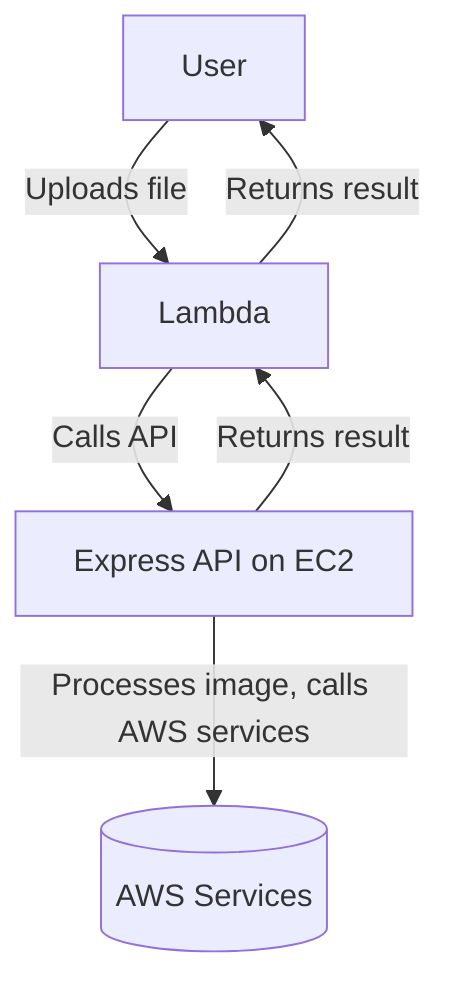

# Serverless Media Processing API

## Overview

This project is a serverless-ready, image and media processing API built with Node.js and Express, designed for cloud-native deployments (e.g., AWS EC2, Lambda triggers). It provides endpoints for:

- **User authentication and management** (via AWS Cognito)
- **Media upload** (with S3 signed URLs)
- **Image processing** (resize, compress, etc.)
- **AI-based image recognition** (using AWS Rekognition)

The API is designed to be triggered by AWS Lambda functions (or other clients), which upload files and call the API for processing and analysis.

---

## Architecture



- **User** uploads a file (e.g., via a web/mobile app).
- **Lambda** function is triggered, which uploads the file to S3 and calls the API (hosted on EC2 or similar).
- **API** processes the image (resize, compress, analyze) and may interact with AWS Rekognition or S3.
- **Results** are returned back through Lambda to the user.

---

## Features

### 1. Authentication (AWS Cognito)
- **Signup:** `/api/auth/signup`
- **Confirm User:** `/api/auth/confirm-user`
- **Signin:** `/api/auth/signin`
- Uses AWS Cognito for secure, scalable user management.

### 2. User Profile
- **Get Profile:** `/api/user/profile` (JWT-protected)

### 3. Media Upload
- **Generate S3 Signed URL:** `/api/media/generate-signed-url`
- Returns a pre-signed S3 URL for secure, direct uploads.

### 4. Image Processing
- **Process Image:** `/api/image/process-image`
    - Accepts image via form-data upload (`image` field) or by URL (`imageUrl` in JSON body).
    - Resizes and compresses the image using [sharp](https://sharp.pixelplumbing.com/).
    - Returns the processed image as a base64 string.

- **AI Recognition:** `/api/image/ai-recognition`
    - Accepts image via form-data upload or by URL.
    - Uses AWS Rekognition to detect labels/objects in the image.
    - Returns detected labels and confidence scores.

---

## File/Folder Structure

```
serverless_processing/
│
├── index.js                # Main Express app entry point
├── app.js                  # (empty, placeholder)
├── package.json            # Project dependencies and scripts
├── sample.png              # Sample image for testing
│
├── controllors/            # All business logic/controllers
│   ├── auth.controllor.js      # Auth (signup, signin, confirm)
│   ├── user.controllor.js      # User profile
│   ├── media.controllor.js     # S3 signed URL generation
│   └── image.controllor.js     # Image processing & AI recognition
│
├── routes/                 # Express route definitions
│   ├── auth.routes.js
│   ├── user.routes.js
│   ├── media.routes.js
│   └── image.routes.js
│
├── middleware/             # Custom middleware (e.g., JWT auth)
│   └── auth.middleware.js
│
├── utils/                  # Utility modules (logging, error, AWS secrets, etc.)
│   ├── ApiError.js
│   ├── ApiResponse.js
│   ├── asyncHandler.js
│   ├── aws-secrets.js
│   ├── generateUserId.js
│   ├── logentries.js
│   └── urlGenerator.js
│
├── test/                   # Test scripts and sample usage
│   ├── api.test.js             # Jest/Supertest API tests
│   └── imageFunctions.test.js  # Standalone function tests
│
└── models/                 # (empty, placeholder for future DB models)
```

---

## Key Components

### Controllers

- **auth.controllor.js:** Handles signup, confirmation, and signin using AWS Cognito.
- **user.controllor.js:** Fetches user profile from Cognito (JWT-protected).
- **media.controllor.js:** Generates S3 signed URLs for secure uploads.
- **image.controllor.js:** Handles image processing (resize/compress) and AI recognition (AWS Rekognition). Accepts both direct file uploads and image URLs (for Lambda integration).

### Utilities

- **aws-secrets.js:** Fetches AWS credentials and secrets from AWS Secrets Manager.
- **ApiResponse.js:** Standardizes API responses.
- **ApiError.js:** Standardizes error handling and logging.
- **asyncHandler.js:** Wraps async route handlers for error safety.
- **logentries.js:** Appends logs to a file with timestamps.
- **urlGenerator.js:** Removes `Content-Type` from S3 signed URLs (for compatibility).
- **generateUserId.js:** Generates unique user IDs.

### Middleware

- **auth.middleware.js:** JWT authentication for protected routes.

---

## API Usage

### Authentication

- **Signup:**  
  `POST /api/auth/signup`  
  Body: `{ "username": "...", "password": "...", "email": "..." }`

- **Confirm User:**  
  `POST /api/auth/confirm-user`  
  Body: `{ "username": "...", "code": "..." }`

- **Signin:**  
  `POST /api/auth/signin`  
  Body: `{ "username": "...", "password": "..." }`  
  Returns: JWT token

### User

- **Get Profile:**  
  `GET /api/user/profile`  
  Header: `Authorization: <JWT token>`

### Media

- **Generate S3 Signed URL:**  
  `GET /api/media/generate-signed-url`  
  Returns: `{ "signed url": "...", "filename": "..." }`

### Image Processing

- **Process Image:**  
  `POST /api/image/process-image`  
  - Form-data: `image` (file)
  - OR JSON: `{ "imageUrl": "https://..." }`
  - Returns: `{ "processedImageBase64": "..." }`

- **AI Recognition:**  
  `POST /api/image/ai-recognition`  
  - Form-data: `image` (file)
  - OR JSON: `{ "imageUrl": "https://..." }`
  - Returns: `{ "labels": [...] }`

---

## Lambda Integration

- Lambda can upload files to S3 using the signed URL from `/api/media/generate-signed-url`.
- Lambda can then call `/api/image/process-image` or `/api/image/ai-recognition` with either:
  - The uploaded file (as form-data)
  - The S3 file URL (`imageUrl` in JSON body)

---

## Running Locally

1. **Install dependencies:**
   ```bash
   npm install
   ```

2. **Set up AWS credentials and secrets:**
   - Store your AWS keys and Cognito details in AWS Secrets Manager under the secret name `serverless-media-processing`.

3. **Start the server:**
   ```bash
   npm start
   ```

4. **Run tests:**
   ```bash
   npm test
   ```

---

## Testing

- **API tests:**  
  Located in `test/api.test.js` (uses Jest and Supertest).
- **Standalone function tests:**  
  Located in `test/imageFunctions.test.js` (for direct function testing with local images).

---

## Security

- All sensitive credentials are managed via AWS Secrets Manager.
- JWT is used for user authentication and protected routes.
- S3 signed URLs ensure secure, time-limited uploads.

---

## Extending

- Add new models in the `models/` directory.
- Add new routes/controllers as needed.
- Integrate with other AWS services as required.

---

## Contributing

1. Fork the repo and create your branch.
2. Make your changes and add tests.
3. Submit a pull request.

---

## License

ISC 